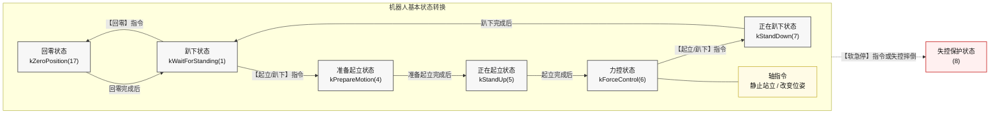

# 绝影 Lite3 运动主机通讯接口 beta V1.0.7

> 本文档由《绝影 Lite3 运动主机通讯接口(beta) V1.0.7》整理为 Markdown，便于工程内查阅。原手册版本：V1.0.7，发布日期：2024-05-15。适用运动程序：`jy_exe_87(20230531)`。

## 目录

- [1 UDP 指令](#1-udp-指令)
  - [1.1 协议格式](#11-协议格式)
  - [1.2 控制指令集](#12-控制指令集)
  - [1.3 接收信息指令集](#13-接收信息指令集)
- [2 附录](#2-附录)

## 版本记录

| 手册版本 | 更新说明                   | 发布日期   |
| -------- | -------------------------- | ---------- |
| V1.0.0   | 初版                       | 2023-06-14 |
| V1.0.1   | 增加原地模式与移动模式指令 | 2023-06-16 |
| V1.0.2   | 更新部分指令说明和状态值   | 2023-07-27 |
| V1.0.3   | 更正平移轴指令说明         | 2023-09-13 |
| V1.0.4   | 更正拉流地址               | 2023-10-17 |
| V1.0.5   | 删除向上跳，增加扬声器开关 | 2023-11-20 |
| V1.0.6   | 删除前空翻                 | 2023-12-13 |
| V1.0.7   | 通信地址说明同步 GitHub    | 2024-05-15 |

## 1 UDP 指令

与运动主机的通信采用 UDP 协议，以小端字节序存放原始数据。

开发者向运动主机发送消息时，目标 IP 请参考 Lite3_MotionSDK 说明第 4.1 节，目标端口为 `43893`。

运动主机默认只向感知主机上报数据。开发者若需接收运动主机上报的信息，可参考 Lite3_MotionSDK 说明第 4 节和第 5 节，通过 SSH 远程连接运动主机，将运动主机发送数据的目标地址修改为开发主机的静态 IP。

### 1.1 协议格式

本节介绍 UDP 传输的原始数据格式。根据是否携带复杂数据，可以将 UDP 指令分为两类：简单指令和复杂指令。

#### 1.1.1 简单指令

简单指令格式为 `[xxxx yyyy zzzz]`，一个字母表示一个字节。

简单指令采用结构体 `CommandHead` 存储原始数据内容。

```cpp
struct CommandHead {
    uint32_t code;
    uint32_t paramters_size;
    uint32_t type;
};
```

| 字段     | 含义                                                                                    |
| -------- | --------------------------------------------------------------------------------------- |
| `xxxx` | `CommandHead.code` 的值，表示指令码                                                   |
| `yyyy` | `CommandHead.paramters_size` 的值，表示指令值；当指令码没有有效指令值时，`yyyy = 0` |
| `zzzz` | `CommandHead.type` 的值，用于区分指令类型；简单指令的类型值为 `0`                   |

使用案例：

```cpp
// 例程
struct CommandHead command_head = {0};
command_head.code = 1;             // 指令码
command_head.paramters_size = 0;   // 指令值
command_head.type = 0;             // 指令类型
sendto(sfd, &command_head, sizeof(command_head), 目标地址, 地址长度);
```

#### 1.1.2 复杂指令

复杂指令携带具体的数据内容，其格式为 `[xxxx yyyy zzzz bbbbbbbb...]`，一个字母表示一个字节。

复杂指令采用结构体 `Command` 存储原始数据内容。

```cpp
struct CommandHead {
    uint32_t code;
    uint32_t paramters_size;
    uint32_t type;
};

const uint32_t kDataSize = 256;

struct Command {
    CommandHead head;
    uint32_t data[kDataSize];
};
```

| 字段            | 含义                                                                      |
| --------------- | ------------------------------------------------------------------------- |
| `xxxx`        | `Command.head.code` 的值，表示指令码                                    |
| `yyyy`        | `Command.head.paramters_size` 的值，表示数据内容 `bbbbbbbb...` 的长度 |
| `zzzz`        | `Command.head.type` 的值，用于区分指令类型；复杂指令的类型值为 `1`    |
| `bbbbbbbb...` | `Command.data` 的值，表示该指令携带的数据内容                           |

使用案例：

```cpp
// 例程
int32_t to_be_send_data[64];
struct Command command = {0};
command.head.code = 52;                            // 指令码
command.head.paramters_size = sizeof(to_be_send_data); // 数据长度
command.head.type = 1;                             // 指令类型
memcpy(&command.data, &to_be_send_data, sizeof(to_be_send_data));
sendto(sfd, &command, sizeof(command.head) + command.head.paramters_size, 目标地址, 地址长度);
```

#### 1.1.3 复杂指令接收

以关节速度为例，使用案例如下：

```cpp
struct RobotJointVel {
    double joint_vel[12];
}; // 以关节速度为例

struct CommandMessage {
    CommandHead command;
    uint8_t data_buffer[1024];
};

CommandMessage cm;
size_t recv_size = 0;
recv_size = recvfrom(server_fd, &cm, sizeof(cm), 0, (sockaddr*)&client_addr, &sockaddr_in_size);

if (cm.command.type == 1) { // 判断为复杂指令
    if (recv_size == cm.command.paramters_size + sizeof(cm.command)) {
        uint8_t* temp_values = new uint8_t[cm.command.paramters_size];
        memcpy(temp_values, cm.data_buffer, cm.command.paramters_size);
        if (cm.command.code == 0x0903) { // 判断指令码，解析数据
            RobotJointVel* joint_vel = (RobotJointVel*)temp_values;
        }
    }
}
```

### 1.2 控制指令集

开发者通过 UDP 通信方式直接向运动主机下发指令，从而控制机器人实现相应功能。请注意，下发消息并不能改变原有的控制逻辑。

绝影 Lite3 同时能接收来自多个手柄的消息，即 `0x2*******` 的指令可以由多个客户端下发，但推流仅能推向最早连接上机器人的客户端。

#### 1.2.1 心跳

心跳用于确认连接是否正常，下发频率应不低于 `2 Hz`。

| 指令码         | 指令值 | 指令类型 |
| -------------- | ------ | -------- |
| `0x21040001` | -      | `0`    |

注意：指令值中 `-` 表示指令值没有意义，即指令值不会对指令起作用。

#### 1.2.2 机器人基本状态转换指令

机器人基本状态转换通过给出相应指令实现，如下图所示（括号中是对应的状态值）。



涉及的部分指令如下表所示：

| 指令名称  | 指令码         | 指令值 | 指令类型 | 指令功能                             |
| --------- | -------------- | ------ | -------- | ------------------------------------ |
| 起立/趴下 | `0x21010202` | -      | `0`    | 在趴下状态和初始站立状态之间轮流切换 |
| 软急停    | `0x21020C0E` | -      | `0`    | 使机器人软急停                       |
| 回零      | `0x21010C05` | -      | `0`    | 初始化机器人关节                     |

#### 1.2.3 轴指令

轴指令是手柄左右摇杆 x 轴和 y 轴输出的指令，其取值范围为 `[-32767, 32767]`。轴指令下发频率应不低于 `20 Hz`。轴指令超时时间为 `250 ms`，当机器人超过 `250 ms` 未收到轴指令时，将自动停止运动。

##### 1.2.3.1 原地模式下的轴指令

原地模式下，客户端发送轴指令给运动主机，可以控制机器人改变身体姿势。如果运动主机超过一秒未收到任何轴指令，系统会认为指令失效，机器人将恢复正常站立姿势。若轴指令值在死区范围内，则视轴指令值为 `0`。

| 指令名称     | 指令码         | 指令类型 | 死区                | 指令功能         |
| ------------ | -------------- | -------- | ------------------- | ---------------- |
| 调整横滚角   | `0x21010131` | `0`    | `[-12553, 12553]` | 取正值时向右翻滚 |
| 调整俯仰角   | `0x21010130` | `0`    | `[-6553, 6553]`   | 取正值时低头     |
| 调整身体高度 | `0x21010102` | `0`    | `[-20000, 20000]` | 取正值时抬高身体 |
| 调整偏航角   | `0x21010135` | `0`    | `[-9553, 9553]`   | 取正值时向右旋转 |

##### 1.2.3.2 移动模式下的轴指令

移动模式下，下发轴指令给运动主机，可以控制机器人改变移动方向和速度。当轴指令取值在死区范围内时，视其值为 `0`，机器人停止移动。轴指令值的正负确定速度方向。

| 指令名称 | 指令码         | 指令类型 | 死区                | 指令功能                                |
| -------- | -------------- | -------- | ------------------- | --------------------------------------- |
| 左右平移 | `0x21010131` | `0`    | `[-12553, 12553]` | 指定机器人 y 轴上的期望线速度，正值向右 |
| 前后平移 | `0x21010130` | `0`    | `[-6553, 6553]`   | 指定机器人 x 轴上的期望线速度，正值向前 |
| 左右转弯 | `0x21010135` | `0`    | `[-9553, 9553]`   | 指定机器人的期望角速度，正值向右转      |

##### 1.2.3.3 停止指令

机器人在运动过程中，若下发轴指令为 `0`，机器人将停止运动。

#### 1.2.4 运动模式切换指令

| 指令名称 | 指令码         | 指令值 | 指令类型 |
| -------- | -------------- | ------ | -------- |
| 原地模式 | `0x21010D05` | -      | `0`    |
| 移动模式 | `0x21010D06` | -      | `0`    |

#### 1.2.5 步态切换指令

机器人处于移动模式下时，可调整其步态。

| 指令名称       | 指令码         | 指令值 | 指令类型 | 指令功能                                                                           |
| -------------- | -------------- | ------ | -------- | ---------------------------------------------------------------------------------- |
| 平地低速步态   | `0x21010300` | -      | `0`    | 使机器人从当前步态切换到低速步态                                                   |
| 平地中速步态   | `0x21010307` | -      | `0`    | 使机器人从当前步态切换到中速步态                                                   |
| 平地高速步态   | `0x21010303` | -      | `0`    | 使机器人从当前步态切换到高速步态                                                   |
| 正常/匍匐      | `0x21010406` | -      | `0`    | 使机器人从当前步态切换到匍匐低速行走步态，或从匍匐低速行走步态切至正常低速行走步态 |
| 抓地越障步态   | `0x21010402` | -      | `0`    | 使机器人从当前步态切换到抓地步态                                                   |
| 通用越障步态   | `0x21010401` | -      | `0`    | 使机器人从当前步态切换到通用步态                                                   |
| 高踏步越障步态 | `0x21010407` | -      | `0`    | 使机器人从当前步态切换到高踏步步态                                                 |

#### 1.2.6 动作指令

机器人静止站立或趴下时，可下发动作指令使其表演相应动作。

| 指令名称 | 指令码         | 指令值 | 指令类型 | 执行动作的条件           |
| -------- | -------------- | ------ | -------- | ------------------------ |
| 扭身体   | `0x21010204` | -      | `0`    | 处于力控状态（静止站立） |
| 翻身     | `0x21010205` | -      | `0`    | 趴下状态                 |
| 太空步   | `0x2101030C` | -      | `0`    | 处于力控状态（静止站立） |
| 后空翻   | `0x21010502` | -      | `0`    | 趴下状态                 |
| 打招呼   | `0x21010507` | -      | `0`    | 趴下状态                 |
| 向前跳   | `0x2101050B` | -      | `0`    | 趴下状态                 |
| 扭身跳   | `0x2101020D` | -      | `0`    | 处于力控状态（静止站立） |

#### 1.2.7 控制模式切换指令

控制模式决定机器人响应的速度指令来源：自主模式下机器人响应由感知主机下发的速度指令，手动模式下机器人响应由手柄下发的速度指令。

| 指令名称 | 指令码         | 指令值 | 指令类型 | 指令功能                       |
| -------- | -------------- | ------ | -------- | ------------------------------ |
| 自主模式 | `0x21010C03` | -      | `0`    | 使机器人从手动模式切入自主模式 |
| 手动模式 | `0x21010C02` | -      | `0`    | 使机器人从自主模式切入手动模式 |

#### 1.2.8 保存数据指令

保存数据功能可用于出现故障时使机器人保存前 100 秒内的数据，机器人将清零电机力矩并关闭运动程序。

| 指令码         | 指令值 | 指令类型 |
| -------------- | ------ | -------- |
| `0x21010C01` | -      | `0`    |

#### 1.2.9 持续运动指令

持续运动开启后，机器人在未收到轴指令时也将保持原地踏步。

| 指令码         | 指令值                      | 指令类型 |
| -------------- | --------------------------- | -------- |
| `0x21010C06` | `-1` = 开启，`2` = 关闭 | `0`    |

#### 1.2.10 语音指令及扬声器指令

手柄 app 通过语音功能识别用户语音，并下发携带相应指令值的语音指令来控制机器人运动。

| 指令码         | 指令值 | 指令类型 |
| -------------- | ------ | -------- |
| `0x21010C0A` | 见下表 | `0`    |

语音指令值对应的指令功能如下表所示：

| 指令值 | 指令值含义   |
| ------ | ------------ |
| `1`  | 起立         |
| `2`  | 坐下         |
| `3`  | 前进         |
| `4`  | 后退         |
| `5`  | 向左平移     |
| `6`  | 向右平移     |
| `7`  | 停止         |
| `8`  | 低头         |
| `9`  | 抬头         |
| `11` | 向左看       |
| `12` | 向右看       |
| `13` | 向左转 90°  |
| `14` | 向右转 90°  |
| `15` | 向后转 180° |
| `22` | 打招呼       |

扬声器指令：

| 指令名称   | 指令码         | 指令值                                                         | 指令类型 |
| ---------- | -------------- | -------------------------------------------------------------- | -------- |
| 扬声器指令 | `0x2101030D` | `0` = 关闭扬声器；`1` = 打开扬声器；`2` = 查询扬声器状态 | `0`    |

如果发送扬声器指令值为 `2`，即查询扬声器状态，运动主机会上报扬声器状态：

| 指令码         | 指令类型 | 数据内容                           |
| -------------- | -------- | ---------------------------------- |
| `0x11050f08` | `0`    | `0` = 关闭状态；`1` = 开启状态 |

#### 1.2.11 感知设置类指令

开发者可向运动主机发送以下指令，以开启或关闭相关功能。

| 指令名称             | 指令码         | 指令值   | 指令类型 |
| -------------------- | -------------- | -------- | -------- |
| 关闭所有 AI 选项功能 | `0x21012109` | `0x00` | `0`    |
| 开启停障             | `0x21012109` | `0x20` | `0`    |
| 开启跟随             | `0x21012109` | `0xC0` | `0`    |

另外，开发者还可向感知主机发送以下指令，目标 IP 及端口为 `192.168.1.103:43899`。

| 指令名称     | 指令码         | 指令值   | 指令类型 |
| ------------ | -------------- | -------- | -------- |
| 开启导航避障 | `0x21012109` | `0x40` | `0`    |

若运动主机 IP 地址为 `192.168.1.120`，则拉取机器人广角相机视频流的地址为 `rtsp://192.168.1.120:8554/test`。若运动主机 IP 地址为 `192.168.2.1`，则拉取机器人广角相机视频流的地址为 `rtsp://192.168.2.1:8554/test`。

#### 1.2.12 速度指令

速度指令为复杂指令，其携带的数据值均为双精度浮点型，需在自主模式下发送。

| 指令名称                     | 指令码     | 指令类型 | 数据取值范围    |
| ---------------------------- | ---------- | -------- | --------------- |
| 指定旋转角速度 `(rad/s)`   | `0x0141` | `1`    | `[-1.5, 1.5]` |
| 指定前后平移的速度 `(m/s)` | `0x0140` | `1`    | `[-1.0, 1.0]` |
| 指定左右平移的速度 `(m/s)` | `0x0145` | `1`    | `[-0.5, 0.5]` |

### 1.3 接收信息指令集

用户可按照指令格式获取运动主机上报的信息。

#### 1.3.1 机器人状态信息

| 指令码     | 指令类型 | 数据内容                    | 发送频率  |
| ---------- | -------- | --------------------------- | --------- |
| `0x0901` | `1`    | 结构体 `RobotStateUpload` | `50 Hz` |

```cpp
struct RobotStateUpload {
    int robot_basic_state;
    int robot_gait_state;
    double rpy[3];
    double rpy_vel[3];
    double xyz_acc[3];
    double pos_world[3];
    double vel_world[3];
    double vel_body[3];
    unsigned touch_down_and_stair_trot;
    bool is_charging;
    unsigned error_state;
    int robot_motion_state;
    double battery_level;
    int task_state;
    bool is_robot_need_move;
    bool zero_position_flag;
    double ultrasound[2];
};
```

| 字段                          | 类型         | 含义                           |
| ----------------------------- | ------------ | ------------------------------ |
| `robot_basic_state`         | `int`      | 机器人基本运动状态             |
| `robot_gait_state`          | `int`      | 机器人当前步态                 |
| `rpy[3]`                    | `double`   | IMU 角度信息                   |
| `rpy_vel[3]`                | `double`   | IMU 角速度信息                 |
| `xyz_acc[3]`                | `double`   | IMU 加速度信息                 |
| `pos_world[3]`              | `double`   | 机器人在世界坐标系下的位姿信息 |
| `vel_world[3]`              | `double`   | 机器人在世界坐标系下的速度信息 |
| `vel_body[3]`               | `double`   | 机器人在身体坐标系下的速度信息 |
| `touch_down_and_stair_trot` | `unsigned` | 无效数据，仅作占位用           |
| `is_charging`               | `bool`     | 无效数据，仅作占位用           |
| `error_state`               | `unsigned` | 无效数据，仅作占位用           |
| `robot_motion_state`        | `int`      | 机器人动作状态                 |
| `battery_level`             | `double`   | 电池电量百分比的小数形式       |
| `task_state`                | `int`      | 无效数据，仅作占位用           |
| `is_robot_need_move`        | `bool`     | 机器人受外力影响时的平衡状态   |
| `zero_position_flag`        | `bool`     | 回零标志位                     |
| `ultrasound[2]`             | `double`   | 超声波数据                     |

`robot_basic_state` 的值对应的机器人基本运动状态如下：

| 变量值 | 机器人基本运动状态 |
| ------ | ------------------ |
| `1`  | 趴下状态           |
| `4`  | 准备起立状态       |
| `5`  | 正在起立状态       |
| `6`  | 力控状态           |
| `7`  | 正在趴下状态       |
| `8`  | 失控保护状态       |
| `9`  | 姿态调整状态       |
| `11` | 执行翻身动作       |
| `17` | 回零状态           |
| `18` | 执行后空翻动作     |
| `20` | 执行打招呼动作     |

注意：机器人基本状态的转换关系可参考 1.2.2。

`robot_gait_state` 的值对应的机器人步态如下：

| 变量值 | 步态           |
| ------ | -------------- |
| `0`  | 平地低速步态   |
| `2`  | 通用越障步态   |
| `4`  | 平地中速步态   |
| `5`  | 平地高速步态   |
| `6`  | 抓地越障步态   |
| `13` | 高踏步越障步态 |
| `12` | 太空步步态     |

`rpy[3]` 包含内容如下：

```cpp
double rpy[3] = {roll, pitch, yaw};
```

| 元素名称  | 含义                                   |
| --------- | -------------------------------------- |
| `roll`  | IMU 在世界坐标系下的 roll 角，单位 °  |
| `pitch` | IMU 在世界坐标系下的 pitch 角，单位 ° |
| `yaw`   | IMU 在世界坐标系下的 yaw 角，单位 °   |

`rpy_vel[3]` 包含内容如下：

```cpp
double rpy_vel[3] = {roll_vel, pitch_vel, yaw_vel};
```

| 元素名称      | 含义                                          |
| ------------- | --------------------------------------------- |
| `roll_vel`  | IMU 在世界坐标系下的 roll 角速度，单位 rad/s  |
| `pitch_vel` | IMU 在世界坐标系下的 pitch 角速度，单位 rad/s |
| `yaw_vel`   | IMU 在世界坐标系下的 yaw 角速度，单位 rad/s   |

`xyz_acc[3]` 包含内容如下：

```cpp
double xyz_acc[3] = {x_acc, y_acc, z_acc};
```

| 元素名称  | 含义                                        |
| --------- | ------------------------------------------- |
| `x_acc` | IMU 在世界坐标系 x 轴上的加速度，单位 m/s² |
| `y_acc` | IMU 在世界坐标系 y 轴上的加速度，单位 m/s² |
| `z_acc` | IMU 在世界坐标系 z 轴上的加速度，单位 m/s² |

`pos_world[3]` 包含内容如下：

```cpp
double pos_world[3] = {x, y, yaw};
```

| 元素名称 | 含义                                      |
| -------- | ----------------------------------------- |
| `x`    | 机器人在世界坐标系下的 x 轴坐标值，单位 m |
| `y`    | 机器人在世界坐标系下的 y 轴坐标值，单位 m |
| `yaw`  | 机器人在世界坐标系下的 yaw 角，单位 rad   |

`vel_world[3]` 包含内容如下：

```cpp
double vel_world[3] = {x_vel, y_vel, yaw_vel};
```

| 元素名称    | 含义                                          |
| ----------- | --------------------------------------------- |
| `x_vel`   | 机器人在世界坐标系 x 轴上的速度，单位 m/s     |
| `y_vel`   | 机器人在世界坐标系 y 轴上的速度，单位 m/s     |
| `yaw_vel` | 机器人在世界坐标系下的 yaw 角速度，单位 rad/s |

`vel_body[3]` 包含内容如下：

```cpp
double vel_body[3] = {x_vel, y_vel, yaw_vel};
```

| 元素名称    | 含义                                          |
| ----------- | --------------------------------------------- |
| `x_vel`   | 机器人在身体坐标系 x 轴上的速度，单位 m/s     |
| `y_vel`   | 机器人在身体坐标系 y 轴上的速度，单位 m/s     |
| `yaw_vel` | 机器人在身体坐标系下的 yaw 角速度，单位 rad/s |

`robot_motion_state` 的值的含义如下：

| 变量值 | 机器人动作状态                                       |
| ------ | ---------------------------------------------------- |
| `0`  | 机器人处于 `robot_basic_state` 的值对应的状态中    |
| `1`  | 机器人正在以 `robot_gait_state` 的值对应的步态踏步 |
| `2`  | 机器人正在执行扭身体                                 |
| `4`  | 机器人正在执行扭身跳                                 |
| `11` | 机器人正在执行向前跳                                 |

注意：机器人基本运动状态 `robot_basic_state`、机器人步态 `robot_gait_state`、机器人动作状态 `robot_motion_state` 共同表示机器人状态，可使用附录 2.2 进行查询。

`is_robot_need_move` 的值的含义如下：

| 变量值 | 平衡状态                   |
| ------ | -------------------------- |
| `0`  | 可保持平衡                 |
| `1`  | 无法保持平衡，踏步调整姿态 |

`zero_position_flag` 的值的含义如下：

| 变量值 | 回零状态                   |
| ------ | -------------------------- |
| `0`  | 未完成回零或已退出回零状态 |
| `1`  | 已完成回零                 |

`ultrasound[2]` 包含内容如下：

```cpp
double ultrasound[2] = {forward_distance, backward_distance};
```

| 元素名称              | 含义                           |
| --------------------- | ------------------------------ |
| `forward_distance`  | 机器人前方障碍物的距离，单位 m |
| `backward_distance` | 机器人后方障碍物的距离，单位 m |

注意：超声波有效量程为 `[0.28 m, 4.50 m]`。当障碍物距离小于 `0.28 m` 时显示为 `0.28 m`，当障碍物距离大于 `4.50 m` 时显示为 `4.50 m`。

#### 1.3.2 机器人关节信息

机器人关节信息包括关节角度、关节角速度等信息，指令码如下：

| 指令名称       | 指令码     | 指令类型 | 数据内容                   | 发送频率   |
| -------------- | ---------- | -------- | -------------------------- | ---------- |
| 关节角度信息   | `0x0902` | `1`    | 结构体 `RobotJointAngle` | `100 Hz` |
| 关节角速度信息 | `0x0903` | `1`    | 结构体 `RobotJointVel`   | `100 Hz` |

```cpp
/// 机器人关节角度，通道 0x0902
struct RobotJointAngle {
    double joint_angle[12]; /// 单位 rad
};

/// 机器人关节角速度，通道 0x0903
struct RobotJointVel {
    double joint_vel[12]; /// 单位 rad/s
};
```

关节信息相关数组中 12 个关节的排列顺序为：左前侧摆关节、左前髋关节、左前膝关节、右前侧摆关节、右前髋关节、右前膝关节、左后侧摆关节、左后髋关节、左后膝关节、右后侧摆关节、右后髋关节、右后膝关节。

## 2 附录

### 2.1 UDP 传输数据内容详解

本节以机器人关节角度上传数据为例进行分析。

```cpp
/* 原始数据，总长度 108 个字节
 * 0209 0000 6000 0000 0100 0000 2efd 3ccf
 * 47e4 e1bf f130 4992 f49e e7bf c3d7 eefe
 * 8567 f13f 9ae4 b66d 6583 f1bf 24d8 f33c
 * 3d00 f13f 8c16 222a 0b1f 0140 e8ba aaaa
 * 3803 ef3f d009 0000 60bd d2bf db04 3353
 * 1150 e73f 7d0b 0000 72f0 e53f 0a3d 0cc3
 * f071 e73f c3d7 eefe 7b52 f93f
 */
/**********************************************************************************/
/// 内容解析
// 0209 0000     // xxxx 命令字为 0x0902
// 6000 0000     // yyyy 正文数据长度为 0x60，即长度为 96 个字节
// 0100 0000     // zzzz 为 1，表示复杂指令，后方有正文数据
/*
 * bbbbbbbbbb...................
 * 以下为数据正文内容，共计 96 个字节，数据为长度为 12 的 double 类型的数组
 * 2efd 3ccf 47e4 e1bf f130 4992 f49e e7bf
 * c3d7 eefe 8567 f13f 9ae4 b66d 6583 f1bf
 * 24d8 f33c 3d00 f13f 8c16 222a 0b1f 0140
 * e8ba aaaa 3803 ef3f d009 0000 60bd d2bf
 * db04 3353 1150 e73f 7d0b 0000 72f0 e53f
 * 0a3d 0cc3 f071 e73f c3d7 eefe 7b52 f93f
 */
// 即对应机器人关节角度
double joint_angle[12] = {
    -0.5591162726995316, -0.7381537301203293, 1.0877742727584383,
    -1.0945791516990426, 1.0625584011991203, 2.1401580135014395,
    0.9691432317102597, -0.2928085327149832, 0.7285238862024487,
    0.6856012344363617, 0.7326587495353192, 1.5826377828902742
};
```

### 2.2 机器人状态查询表

`(robot_basic_state, robot_gait_state, robot_motion_state)` 的值对应的状态如下表所示：

| 值             | 状态                                           |
| -------------- | ---------------------------------------------- |
| `(1, 0, 0)`  | 趴下状态                                       |
| `(1, 0, 11)` | 正在执行向前跳                                 |
| `(4, 0, 0)`  | 准备起立状态                                   |
| `(5, 0, 0)`  | 正在起立状态                                   |
| `(6, 0, 0)`  | 力控状态（静止站立）且步态为平地低速步态       |
| `(6, 0, 1)`  | 正在以平地低速步态踏步或正在根据轴指令扭动身体 |
| `(6, 0, 2)`  | 正在执行扭身体                                 |
| `(6, 0, 4)`  | 正在执行扭身跳                                 |
| `(6, 2, 0)`  | 力控状态（静止站立）且步态为通用越障步态       |
| `(6, 2, 1)`  | 正在以通用越障步态踏步                         |
| `(6, 4, 0)`  | 力控状态（静止站立）且步态为平地中速步态       |
| `(6, 4, 1)`  | 正在以平地中速步态踏步                         |
| `(6, 5, 0)`  | 力控状态（静止站立）且步态为平地高速步态       |
| `(6, 5, 1)`  | 正在以平地高速步态踏步                         |
| `(6, 6, 0)`  | 力控状态（静止站立）且步态为抓地越障步态       |
| `(6, 6, 1)`  | 正在以抓地越障步态踏步                         |
| `(6, 12, 1)` | 正在执行太空步                                 |
| `(6, 13, 0)` | 力控状态（静止站立）且步态为高踏步越障步态     |
| `(6, 13, 1)` | 正在以高踏步越障步态踏步                       |
| `(7, 0, 0)`  | 正在趴下状态                                   |
| `(8, 0, 0)`  | 失控保护状态                                   |
| `(9, 0, 0)`  | 姿态调整状态                                   |
| `(11, 0, 0)` | 正在执行翻身                                   |
| `(17, 0, 0)` | 回零状态                                       |
| `(18, 0, 0)` | 正在执行后空翻                                 |
| `(20, 0, 0)` | 正在执行打招呼                                 |
